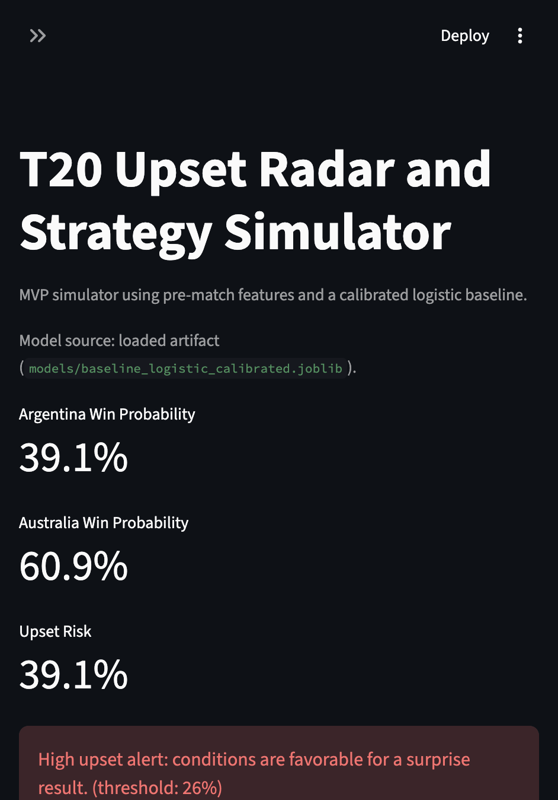

# T20 Upset Radar and Strategy Simulator

This project builds a calibrated match outcome modeling pipeline for T20 World Cups with a specific focus on underdog upsets. It pairs an analysis workflow (notebooks + reusable Python modules) with an interactive Streamlit simulator to test "what-if" scenarios such as toss choice, venue, and stage context.

## Problem Framing

Most cricket forecasting work optimizes for generic winner prediction. This project targets a narrower and more useful question: when does an underdog beat a favorite, and how do pre-match conditions shift upset risk?

Two deliverables drive the work:

- Upset Radar: detect and analyze historical upsets.
- Strategy Simulator: compare scenario-level win probabilities and upset risk.

## Dataset

Primary dataset:

- `data/raw/world_cup_last_30_years.csv`
- Kaggle source: `T20 World Cup 2026 AI Prediction and Analysis` by Ibrahim Shahrukh  
  https://www.kaggle.com/datasets/ibrahimshahrukh/t20-world-cup-2026-ai-prediction-and-analysis?resource=download

The dataset includes match metadata, teams, venue, toss context, results, and pre-match style features such as ELO values, rolling form metrics, and head-to-head indicators.
Raw audit row count is `3865`; model-ready supervised workflows operate on completed matches (`3761` rows after `match_result == completed` filtering).

Attribution: this project reuses the Kaggle dataset above for analysis and modeling; full credit to the original dataset author/publisher.

## Project Structure

- `data/raw/` raw source files
- `data/processed/` model-ready outputs
- `src/` reusable Python modules
- `notebooks/` exploratory + modeling notebooks
- `docs/` data and design notes
- `models/` serialized model artifacts
- `app.py` Streamlit strategy simulator

## Quickstart

Run all commands from the project root.

1. Create and activate a Python 3.10+ virtual environment.
   - `python3 -m venv .venv`
   - `source .venv/bin/activate`
2. Install dependencies:
   - `pip install -r requirements.txt`
3. Run notebook analysis in order:
   - `notebooks/01_data_audit.ipynb`
   - `notebooks/02_model_baseline.ipynb`
   - `notebooks/03_upset_explorer.ipynb`
4. Run final narrative notebook:
   - `notebooks/99_final_story.ipynb`
5. Train and save calibrated artifacts (recommended before simulator):
   - `python scripts/train_and_save.py`
6. Run the simulator:
   - `streamlit run app.py`
   - Use **Export for slides (CSV)** and **Export for audit traces (JSON)** in the app to export scenario audits with model metadata.
7. Run tests:
   - `pytest`
8. Run quality gates locally:
   - `ruff check .`
   - `mypy src scripts app.py`
   - `python scripts/check_conventions.py`
9. Run tests with coverage:
   - `pytest --cov=src --cov=scripts --cov-report=term-missing --cov-fail-under=70`
10. Regenerate data quality report:
   - `python scripts/run_data_quality.py`

## Dashboard Walkthrough

The Streamlit app now uses a multi-tab dashboard:

- `Simulator`: scenario inputs, win probabilities, upset alerts, scenario deltas, and exports.
- `How It Works`: plain-language logic for favorite/underdog, upset-risk thresholds, and priors fallback tiers.
- `Insights`: calibration curve, validation/test metrics, ELO-gap upset buckets, and notable upset table.
- `Explainability`: local counterfactual view, missed-upsets audit, curated upset narratives, and pattern summaries.

## Automation

- CI workflow: `.github/workflows/ci.yml`
  - dependency install
  - lint (`ruff`)
  - type check (`mypy`)
  - conventions check
  - compile check
  - test suite (`pytest`)

## Pre-commit Hooks

- Install once:
  - `pre-commit install`
- Run manually:
  - `pre-commit run --all-files`

## Development Roadmap

1. Data audit and schema validation.
2. Leakage-safe target and upset labeling.
3. Feature engineering for team strength and context effects.
4. Calibrated baseline + boosted models with time-aware splits.
5. Explainability and upset pattern analysis.
6. Scenario simulator improvements.

## Model Card (MVP)

- Model: calibrated logistic regression (`baseline_logistic_calibrated`)
- Train/valid/test split policy: strict chronological split from `src/config.py`
- Input policy: pre-match features only (no post-match leakage fields)
- Calibration: sigmoid calibration on validation set (`CalibratedClassifierCV`)
- Primary use: scenario-level probability guidance and upset-risk exploration (not betting advice)

### Current Metrics Snapshot

Source: `data/processed/baseline_logistic_calibrated_metrics.json`
Note: these values reflect the latest saved artifact run; your local metrics may vary after retraining.
Refresh command: run `python scripts/train_and_save.py` to regenerate metrics and artifacts before demos.

| Split | ROC AUC | Log Loss | Brier | Predicted Positive Rate |
|---|---:|---:|---:|---:|
| Validation | 0.6320 | 0.6646 | 0.2362 | 0.3972 |
| Test | 0.6399 | 0.6681 | 0.2377 | 0.4021 |

## MVP Capability Changelog

- Stage-aware upset alerting in simulator output.
- Scenario comparison deltas and matchup volatility radar.
- Priors confidence diagnostics with fallback tiers (including city tier).
- Scenario export workflow (CSV + JSON) with model metadata and timestamps.
- Final narrative notebook with missed-upsets audit and curated upset stories.

## App Demo

### How to Read the Dashboard

- Start in `Simulator` to set teams, realistic venues, and match context.
- Use `Underdog Win Probability` for surprise likelihood and `Upset Severity Index` for surprise impact.
- Check `Risk Context` for head-to-head volatility before trusting scenario deltas.
- Use `Insights` to compare observed vs predicted upset behavior (ELO buckets and venue hotspots).

### Live Demo Flow (2-3 minutes)

- Set a rivalry matchup in `Simulator`, keep realistic venue filtering on, and highlight the `Upset Alert`.
- Toggle toss decision and use the comparison table to narrate probability movement.
- Open `Insights` to show calibration + ROC trust interpretation + venue sample-size cautions.
- Finish in `Explainability` with one counterfactual case and one missed-upset audit row.

### When to Trust This Dashboard

- **High confidence:** priors source is `matchup_venue` or `matchup`, with healthy sample counts and stable validation/test ROC alignment.
- **Medium confidence:** priors source is `venue` or `city`, and calibration remains reasonably aligned with the diagonal.
- **Low confidence:** priors source is `global`, or venue/matchup history is very sparse; use as exploratory signal only.
- Always combine scenario probabilities with `Risk Context`, calibration view, and sample-size cautions before decisions.

## Upset Definition (MVP)

For each match, the favorite is the side with stronger pre-match rating proxy (initially ELO). A match is labeled `is_upset = 1` when the underdog wins.

## Code Conventions

See [docs/code_conventions.md](docs/code_conventions.md) for module boundaries, typing, naming, leakage rules, testing, notebook hygiene, and Streamlit patterns.

## Anti-Leakage Principles

- Only pre-match variables are allowed in model features.
- Time-based train/validation/test splits are mandatory.
- Post-match outcome fields (result margins, innings outcomes, etc.) are excluded from prediction features.

## Limitations and Future Work

Limitations:
- Current primary model family is a calibrated logistic baseline chosen for interpretability and stable reviewer-facing diagnostics; XGBoost training support is available for next-phase comparison.
- Team-level and venue-level proxies are used; no player-level or ball-by-ball context yet.
- Rare-event upsets remain difficult, especially for extreme outlier matches.

Future work:
- Add a boosted model comparison artifact and tracked report against the baseline.
- Add curated 5-10 upset deep-dives with richer counterfactual narratives.
- Extend simulator with watchlist ranking and stronger venue/city condition features.

