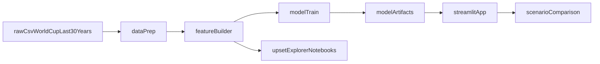

# Design Notes: Upset Radar and Strategy Simulator

## System Goals

1. Predict match win probabilities with leakage-safe, time-aware modeling.
2. Detect and analyze underdog upsets explicitly.
3. Provide a simple strategy simulator for scenario comparisons.

## Architecture

## Module Responsibilities

- `src/data_prep.py`: load data, construct target, upset labels, time splits.
- `src/features.py`: pre-match feature frame and context interactions.
- `src/models.py`: preprocessing, training, calibration, and evaluation helpers.
- `src/simulation.py`: scenario payload to model-ready features and scoring.
- `src/viz.py`: calibration and upset pattern visual helpers.

## Anti-Leakage Rules

- Use only pre-match columns in `X`.
- Keep `winner`, innings, and result outcome fields out of model inputs.
- Use chronological train/validation/test partitions.

## MVP Scope

- Logistic baseline available end-to-end.
- Streamlit app reads inputs and returns win probability + upset risk.
- Scenario comparison supports toss decision switch.

## Future Extensions

- Add calibrated gradient boosted model and compare against baseline.
- Add SHAP-based local explanations for scenario-level outputs.
- Persist trained artifacts and load them in Streamlit without re-training.

